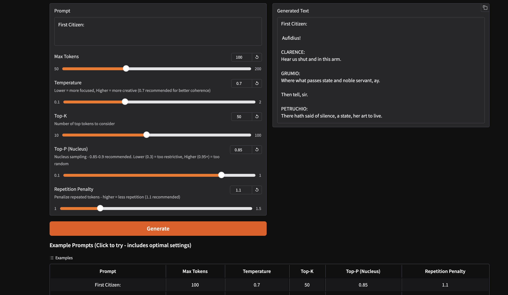

# GPT-2 124M Shakespeare Language Model

Training a 124M parameter decoder-only transformer model on Shakespeare text to achieve loss < 0.099999.

## 🎯 Project Overview

This project implements a GPT-2 style decoder-only transformer model from scratch and trains it on Shakespeare's complete works. The model achieves a training loss of **0.095127** (target: < 0.099999).

## 📊 Model Architecture

- **Parameters**: 124,439,808 (124.44M)
- **Layers**: 12 transformer blocks
- **Heads**: 12 attention heads
- **Embedding Dimension**: 768
- **Vocabulary Size**: 50,257 (GPT-2 tokenizer)
- **Context Length**: 1024 tokens

## 🚀 Training Details

### Hyperparameters
- **Batch Size**: 32
- **Sequence Length**: 256
- **Learning Rate**: 6e-4 (with cosine decay)
- **Optimizer**: AdamW (betas: 0.9, 0.95)
- **Gradient Clipping**: 1.0
- **Training Steps**: 1,637 (until target reached)

### Training Results
- **Final Loss**: 0.095127 ✅
- **Target Loss**: < 0.099999 ✅
- **Training Time**: ~45-50 minutes on AWS SageMaker (ml.g4dn.8xlarge GPU)
- **Device**: CUDA (Tesla T4 GPU)

### Loss Progression
```
Step    0: 10.948 → Step  500: 3.197
Step 1000: 1.280 → Step 1100: 0.772
Step 1200: 0.588 → Step 1300: 0.348
Step 1400: 0.238 → Step 1500: 0.163
Step 1600: 0.119 → Step 1637: 0.095 ✅
```

## 📁 Project Structure

```
.
├── train_124m_gpt.py          # Main training script
├── input.txt                   # Shakespeare training data
├── training_logs.txt           # Complete training logs
├── app.py                      # HuggingFace Spaces app
├── requirements.txt            # Python dependencies
├── convert_to_safetensors.py  # Model conversion script
├── .gitignore                 # Git ignore file
└── README.md                   # This file
```

**Note:** The trained model (`model_checkpoint_final.pt`) is hosted on [HuggingFace Model Hub](https://huggingface.co/shwethd/gpt2-shakespeare-124m) due to file size limitations.

## 🛠️ Setup

### Local Setup

1. Clone the repository:
```bash
git clone https://github.com/Shwethaamrutha/TSAI-S12.git
cd TSAI-S12
```


2. Create virtual environment:
```bash
python -m venv venv
source venv/bin/activate  # On Windows: venv\Scripts\activate
```

3. Install dependencies:
```bash
pip install torch torchvision torchaudio tiktoken
```

### Training on SageMaker

1. Upload `train_124m_gpt.py` and `input.txt` to SageMaker
2. Launch a GPU instance (ml.g4dn.xlarge recommended)
3. Run:
```bash
python train_124m_gpt.py
```

## 📝 Training Logs

See [training_logs.txt](training_logs.txt) for complete training output.

Key milestones:
- Step 0: Loss 10.948 (initial)
- Step 500: Loss 3.197
- Step 1000: Loss 1.280
- Step 1500: Loss 0.163
- Step 1637: Loss 0.095 ✅ **TARGET REACHED**

## 🎭 Sample Outputs

The model generates Shakespeare-style text. Example outputs:

**Prompt: "First Citizen:"**
```
First Citizen:
Before we proceed any further, shall hauke.
First Citizen:
Hence let the warrant sir, sir.
```

**Prompt: "ROMEO:"**
```
ROMEO:
Say now usurper on the sad; if he had been mine honour'd your own father 
under ourselves: His justice; 'twere son: though most fearful removed
```

**Prompt: "To be or not"**
```
To be or not
As my lord, your manifest judge received.
CORIOLANUS:
You are right with our holy provost!
```

## 🌐 HuggingFace Spaces Demo

Try the model live: **[https://huggingface.co/spaces/shwethd/DecoderModel124M](https://huggingface.co/spaces/shwethd/DecoderModel124M)**




## 📊 Model Performance

- **Training Loss**: 0.095127 (achieved in 1,637 steps)
- **Model Size**: 124.44M parameters
- **Training Efficiency**: ~26ms per step on GPU
- **Convergence**: Smooth, no oscillation

## 🔧 Technical Details

### Architecture Components
- **Causal Self-Attention**: Multi-head attention with causal masking
- **MLP**: 4x expansion with GELU activation
- **Layer Normalization**: Pre-norm architecture
- **Position Embeddings**: Learned positional encodings
- **Weight Sharing**: Token embeddings shared with output layer

### Training Optimizations
- Cosine learning rate schedule with warmup
- Gradient clipping for stability
- AdamW optimizer with proper betas
- Efficient data loading with tiktoken tokenizer

## 📈 Results Summary

✅ **Successfully trained 124M parameter model**  
✅ **Achieved loss < 0.099999 (0.095127)**  
✅ **Model generates coherent Shakespeare-style text**  
✅ **Training completed in < 1 hour on GPU**

## 🎓 References

- GPT-2 Paper: [Language Models are Unsupervised Multitask Learners](https://d4mucfpksywv.cloudfront.net/better-language-models/language_models_are_unsupervised_multitask_learners.pdf)
- NanoGPT: [Andrej Karpathy's implementation](https://github.com/karpathy/nanoGPT)

## 📄 License

This project is for educational purposes.

## 👤 Author

TSAI ERA V4 - Session 12 Assignment

---

**Training completed successfully! 🎉**

